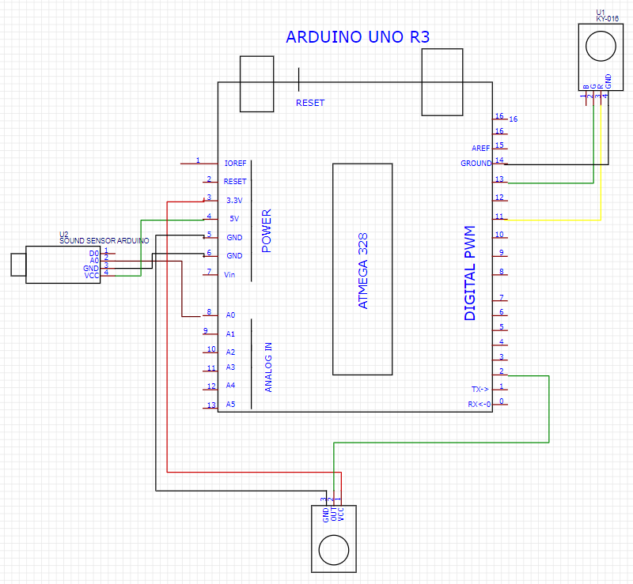
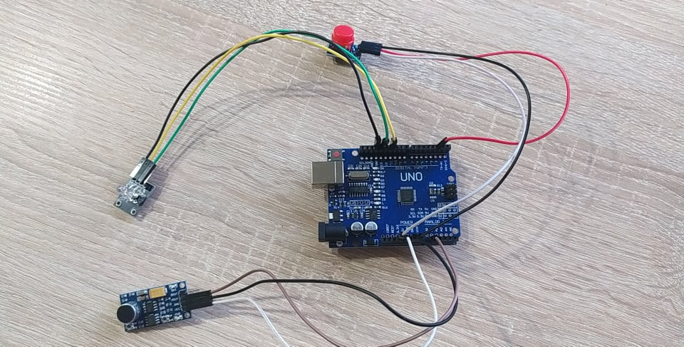

# Projekt SW
## Zapalanie lampki dzwiękiem

#### Spis treści
 - Opis projektu
 - Rozwój projektu
 - Zdjęcia układu


## Opis projektu
Projekt ma następujące założenia:
 - Zostanie stworzony układ składający się z
    - lampki LED
    - mikrofonu
    - przycisku
 - Układ ma reagować na głośny dzwięk (klaśnięcie / pstryknięcie) zmieniając stan lampki
 - Układ ma zasygnalizować lampką (innym kolorem) czy jest gotowy do pracy
 - Układ ma dostosowywać się do otaczających warunków
 - Układ ma pozwalać na zmiane czujności za pomocą przycisku
 - Układ ma być odporny na drobne zakłócenia

### Opis implementacji

0. Globalne stałe
```c
#define maxM 500
```
Opisuje ile próbek sygnału (dzwięku) może się maksymalnie znajdywać w pamięci w tym samym czasie
```c
#define minMToCheck 100
```
Opisuje ile próbek trzeba sprawdzić w tył w poszukiwaniu "doliny" (czyli przerwy pomiędzy sygnałami wysokimi)
```c
#define minValleyLength 80
```
Opisuje minimalną szerokość "doliny".
```c
const int sensorPin = A0;
const int readyLedPin = 13;
const byte btnPin = 2;
```
Opisują adresy wyjść/wejść dla poszczególnych elementów układu. `sensorPin` oznacza analogowe wejście mikrofonu, `readyLedPin` oznacza cyfrowe wyjście diodu która zostanie wykorzystana do sygnalizacji stanu, `btnPin` oznacza cyfrowe wejście przycisku
```c
volatile byte lightIsOn = LOW;
volatile byte prevLightIsOn = LOW;
```
Mutowalne zmienne globalne, opisują elementu stanu programu. `lightIsOn` oznacza aktualny stan lampki która ma być zapalana / gaszona przy wykryciu głóśnego dzwięku. `prevlightIsOn` przechowuje poprzedni stan `lightIsOn` w celu wywołania opóźnienia po zmianie stanu
```c
int threshold = 300;

int m[maxM] = {0};
int index = 0;
int ledPin = 11;
```
Kolejne mutowalne zmienne - `threshold` oznacza różnice pomiędzy średnim poziomem dzwięku a nowo pobranym stanem, `m` przechowuje `maxM` pobranych stanów z mikrofonu, `index` przechowuje informacje na które miejsce w `m` ma zostać wpisany nowy wpis. `ledPin` oznacza który pin zostanie użyty do sygnalizacji głośnego sygnału.

1. Funkcje
```c
byte isReady(int index) {
 return index == maxM - 1;
}
```
Decyduje czy układ jest gotowy do obsługi sygnałów. Determinuje o tym aktualny index - jeśli jest wystarczająco wysoki, to znaczy to, że tablica jest uzupełniona wynikami.
```c
void changeThreshold() {
  threshold = (threshold + 10 - 250) % 150 + 250;
}
```
Zmienia threshold wykrywania. Zostanie użyte jako handler przerwania na przycisku.
```c
void writeAndPushBack(int value, int index) {
  if (index == maxM - 1) {
    for (int i = 0; i < index; i++) {
      m[i] = m[i+1];
    }
  }

  m[index] = value;
}
```
Wpisuje do tablicy. Jeśli tablica jest pełna, to cofa wszystkie wyniki o 1, wpisując nowy na ostatni index.
```c
boolean isPeak(int index) {
  unsigned long int total = 0;
  int avg = 0;

  int value = m[index];

  for (int i = 0; i < index; i++) {
    total += m[i];
  }

  avg = total / index;

  if (value <= avg) {
    return false;
  }

  return (value - avg) > threshold;
}
```
Decyduje czy dany punkty jest szczytem, czyli czy jest większy od średniej wartości poprzednich wyników. Funkcja sprawdza czy różnica pomiędzy średnią a aktualną wartością jest większa od `threshold`
```c
boolean isNewPeak(int index) {
  if (!isPeak(index)) {
    return false;
  }

  for (int i = index; i > index - minMToCheck; i--) {
   boolean wasValley = true;

   for (int j = i; j > i - minValleyLength; j--){
     if (isPeak(j)) {
       wasValley = false;
       break;
     }
   }

   if (wasValley) {
    return true;
   }
  }

  return false;
}
```
Sprawdza czy punkty jest nowym szczytem - sprawdza czy w odległości `minValleyLength` jest wystarczająca ilość ciągłych punktów (`minValleyLength`) która nie jest szczytem. Jeśli tak jest, to znaczy, że nowy szczyt jest wystarcząco daleko od poprzednich aby uznać go za nowy
```c
void setup() {
  for (int i = 0; i < ledAmount; i++) {
      pinMode(ledOffset + i, OUTPUT);
  }

  pinMode(readyLedPin, OUTPUT);
  attachInterrupt(digitalPinToInterrupt(btnPin), changeThreshold, RISING);
}
```
Setup jest funkcją wymaganą przez kompilator arduino. Inicjalizuje ona obsługę przerwań i tryb diód
```c
void loop() {
  byte ready = isReady(index);
  digitalWrite(readyLedPin, !ready);

  writeAndPushBack(analogRead(sensorPin), index);
  prevLightIsOn = lightIsOn;

  if (ready) {
     if (isNewPeak(index)) {
        lightIsOn = !lightIsOn;
     }

     digitalWrite(ledPin, lightIsOn);
  } else {
     index++;
  }

  if (prevLightIsOn != lightIsOn) {
    delay(100);
  }
}
```
Funkcja loop jest wywoływana co takt zegara. W niej pobrany zotanie nowy stan odczytany z mikrofu, sprawdzony zostanie czy nowy punkt jest szczytem, i jeśli tak jest, to zostanie zmieniony stan lampki.
Dodatkowo, dopóki tablica pomiarów nie jest wypełniona to zapala to lamkę w innym kolorze, aby wskazać na to aby poczekać.

## Rozwój projektu

Układ początkowo używał mikrofonu który posiadał jedynie wyjście cyfrowe. Z tego powodu, trudniej (tzn. ręcznie) dostosowywało się go do różnych poziomów głośności szumów w tle. Mikrofon nie posiadał też możliwości programowej konfiguracji progu głośności, przez co, realizacja projektu w zadowalającej formie nie była możliwa.

Układ początkowo nie posiadał także zewnętrznej diody LED - używał on tej wbudowanej w układ. Jednak wynikało z tego, to, że nie dało się w jasny sposób zasygnalizować użytkownikowi, że układ jest gotowy do pracy (w finałowej wersji układu, jest to sygnalizowane innym kolorem lampki LED niż ten który użyty jest podczas wykrywania klaśnięć).

Do układu, w późniejszym etapie rozwoju został dodany także przycisk regulujący `threshold` od którego wykrywane jest klaśnięcie. O ile program dostosowuje się do poziomu głośności w tle, to użytkownik może zażyczyć sobie aby cichsze dzwięki były również wykrywane.

## Zdjęcia układu
Schemat układu


Zdjęcie układu

